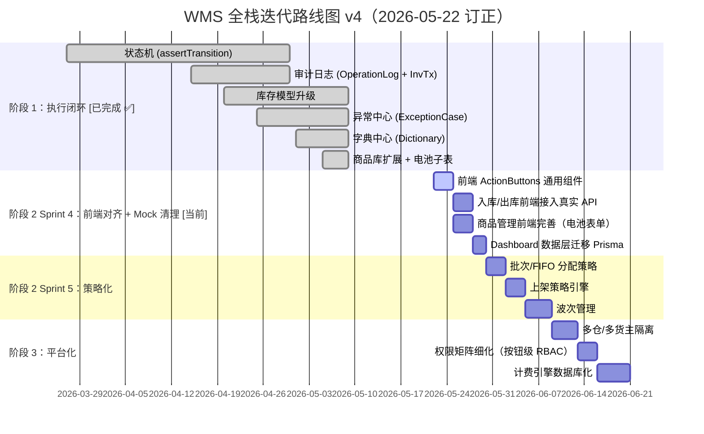

# WMS 全栈优化报告 v4 — 阶段 1 收官与阶段 2 启动

> 基于 v3 报告（2026-03-27）+ 代码库全量审计（2026-05-22）  
> 订正日期：2026-05-22

---

## 执行摘要

v3 报告规划了 **3 个 Sprint + 2 个阶段** 的迭代路线。经过近两个月的推进，**阶段 1 的 5 项核心短板已全部落地**，系统从"能用"升级为"可执行、可追溯、可信赖"的 WMS。最重要的增量是 **商品库全量扩展**（Product 主表 11→35+ 字段 + ProductBattery 电池子表 15 字段 + Excel 模板导入 + 条件校验引擎），这是 v3 中未规划的新增项。

本报告在此基础上：
1. **全量审计** 各项短板当前进展
2. **确认阶段 1 收官**
3. **规划阶段 2（策略化）启动目标**

---

## 一、进展评估矩阵（v3 → v4 对比）

| # | v2 提出的短板 | v3 状态 | v4 状态 | 落地证据 |
|---|-------------|---------|---------|---------|
| 1 | 策略层（分配/上架/波次） | 🔴 待做 | 🔴 待做 | 阶段 2 首个 Sprint |
| 2 | **执行闭环（状态机）** | 🟡 任务书完成 | ✅ **已落地** | `state-machine.ts` — `assertTransition()` + 入库 10 态 + 出库 11 态 |
| 3 | **追溯能力（审计日志）** | 🟡 设计完成 | ✅ **已落地** | `InventoryTransaction` + `OperationLog` model + service |
| 4 | 多租户能力 | 🔴 待做 | 🔴 待做 | 阶段 3 |
| 5 | **运营分析 Dashboard** | 🟢 视觉完成 | 🟢 视觉完成 | PageContainer 标准化；数据层待迁移 |
| 6 | **库存模型升级** | 🔴 待做 | ✅ **已落地** | `expiryDate` / `inventoryStatus` / `serialNo` / `containerNo` / `inboundDate` |
| 7 | 波次管理 | 🔴 待做 | 🔴 待做 | 阶段 2 |
| 8 | 计费引擎 | 🔴 待做 | 🔴 待做 | 阶段 3 |
| 9 | PDA 扫码作业 | 🔴 待做 | 🔴 待做 | 阶段 4 |
| 10 | **异常处理体系** | 🔴 待做 | ✅ **已落地** | `ExceptionCase` 统一模型 + 5 态状态机 + `ExceptionCaseService` 全 CRUD |
| 11 | **字典/配置中心** | 🔴 待做 | ✅ **已落地** | `Dictionary` model + service + controller + 7 类种子数据 |
| 12 | 前端领域组件 | 🟡 进行中 | 🟡 进行中 | Product 页面已重构；ActionButtons 待全面推广 |
| 13 | 请求层增强 | 🔴 待做 | 🔴 待做 | 低优先 |
| 14 | 权限矩阵 | 🔴 待做 | 🟡 部分完成 | Controller 级 `@Roles()` 装饰器已接入 |
| 15 | Mock → 真实 API | 🟡 进行中 | 🟡 进行中 | 入库/出库/中转/客户/产品已 Prisma；仅 Dashboard 数据仍 Mock |
| **16** | **商品库扩展 + 电池合规** | *v3 未规划* | ✅ **已落地** | **新增项** — 详见下文 §二 |

### 📊 阶段 1 完成率

```
v3 规划 5 项：状态机 / 审计日志 / 库存升级 / 异常中心 / 字典中心
v4 实际：    5/5 ✅ + 1 项额外（商品库扩展）

阶段 1 完成率：100%（+ 超额交付 1 项）
```

---

## 二、v3 → v4 新增重大变更：商品库全量扩展

> [!IMPORTANT]
> 这是 v3 报告中完全未规划、但在 v4 周期内完整落地的重大功能。

### 2.1 Product 主表扩展（11 → 35+ 字段）

| 字段分组 | 新增字段 | 说明 |
|---------|---------|------|
| **中英文品名** | `nameZh`, `nameEn` | 原 `name` 保留为兼容显示字段 |
| **贸易合规** | `hsCode`, `originCountry`, `declaredValue`, `actualValue`, `currency`, `material`, `usage` | 海关申报必填 |
| **供应链属性** | `brand`, `supplier`, `model`, `itemType`, `packagingAttr`, `salesUrl`, `catalogue`, `warehouseCodes` | 供应商 + 分类 |
| **监管合规** | `batteryConfig`, `isHazardous`, `hazardCode`, `prop65`, `isFood`, `isRefrigerated`, `hasSerialNumber`, `isLotControlled` | 跨境物流核心 |
| **单位精度** | `weightUnit`, `dimensionUnit` | 支持 kg/lb/g + cm/in/mm |

### 2.2 ProductBattery 电池子表（15 字段）

独立 1:1 子表，仅当 `batteryConfig ∈ {内置电池, 配套电池, 纯电池}` 时才需填写：

| 字段 | 说明 |
|------|------|
| `batteryType` / `cellOrPack` / `batteryModel` | 电池基本信息 |
| `quantity` / `weightGrams` / `capacityMah` / `voltageV` / `lithiumContentG` | 电池物理参数 |
| `packageMaterial` / `packaging` / `chargeStatus` | 包装与状态 |
| `carryingLabel` / `unCode` / `msdsFileList` | 合规标签与证书 |

### 2.3 条件校验引擎

`products.service.ts` 中实现了基于模板 V2 的**条件必填**规则：

- `isHazardous = true` → `hazardCode` 必填
- `batteryConfig ∈ {内置/配套/纯电池}` → 8 个电池字段必填
- `batteryType = 锂离子/纽扣/铅酸/其他` → `capacityMah` + `voltageV` 必填
- `batteryType = 锂金属电池` → `lithiumContentG` 必填

### 2.4 Excel 模板导入

`bulkImportExcel()` 支持直接解析《海外仓商品库上传模板 V2》Excel 文件：
- 44 列中英文表头自动映射
- 电池子字段自动拆分到 `ProductBattery` 子表
- 布尔字段（是/Y/Yes/true/1）自动转换
- 按 SKU 去重，存在则更新、不存在则创建

---

## 三、已落地功能的 Schema 实况

```diff
  # ── v3 Sprint 1 计划 → v4 已落地 ──
+ state-machine.ts             # assertTransition() 通用守卫 ✅
  # 注：StatusChangeLog 未建独立表，由 OperationLog 统一覆盖

  # ── v3 Sprint 2 计划 → v4 已落地 ──
+ model InventoryTransaction   # 7 字段 + 4 索引 ✅
+ model OperationLog           # 9 字段 + 3 索引 ✅

  # ── v3 Sprint 3 计划 → v4 已落地 ──
  model Inventory {             # 扩展 5 字段 ✅
+   expiryDate, inventoryStatus, serialNo, containerNo, inboundDate
  }
+ model ExceptionCase          # 16 字段 + 4 索引 + 5 态枚举 ✅

  # ── v3 阶段 2 计划 → v4 已提前落地 ──
+ model Dictionary             # 10 字段 + 种子 7 类 ✅

  # ── v4 新增（v3 未规划）──
  model Product {               # 11 → 35+ 字段 ✅
+   nameZh, nameEn, hsCode, originCountry, declaredValue, ...
+   batteryConfig, isHazardous, hazardCode, prop65, ...
  }
+ model ProductBattery          # 15 字段 1:1 子表 ✅
```

---

## 四、v3 → v4 优先级变化说明

| 原计划 | 项目 | v4 状态 | 变更原因 |
|--------|------|---------|---------|
| Sprint 1 | 状态机 | ✅ 已落地 | `assertTransition()` + 10/11 态定义 |
| Sprint 2 | 审计日志 | ✅ 已落地 | `OperationLog` 统一覆盖（取代单独 StatusChangeLog） |
| Sprint 3 | 库存升级 + 异常中心 | ✅ 已落地 | Schema + Service + Controller 全套 |
| 阶段 2 第 5 项 | 字典/配置中心 | ✅ 已提前落地 | 商品库扩展依赖字典驱动，提前引入 |
| *未规划* | 商品库扩展 + 电池合规 | ✅ 新增落地 | 业务驱动（客户要求按模板 V2 导入） |
| 阶段 2 第 1-4 项 | 批次/FIFO/上架策略/波次 | 🔴 待做 | 下一阶段首要目标 |
| 阶段 3 | 多租户/计费/权限 | 🔴 待做 | 依赖阶段 2 |

---

## 五、修订迭代路线图



---

## 六、现阶段开发目标（阶段 2 启动）

### 🎯 Sprint 4：前端对齐 + Mock 清理（本周，P0）

> [!IMPORTANT]
> 后端阶段 1 功能已全部落地，但前端仍有多处使用 Mock 数据或未对接新 API。本 Sprint 的目标是**前后端完全对齐**。

| 任务 | 说明 | 涉及文件 |
|------|------|---------|
| ActionButtons 通用组件 | 基于后端 `allowedActions` 动态渲染操作按钮 | `src/components/ActionButtons/` |
| 入库页面接入真实 API | 替换 Mock → 调用 POST `/receiving-orders/:id/arrive\|check\|receive\|complete` | `pages/Inbound/` |
| 出库页面接入真实 API | 对接状态机 POST 端点 | `pages/Outbound/` |
| 商品管理前端完善 | 新增/编辑表单增加电池信息折叠区、合规字段、Excel 导入入口 | `pages/Product/index.tsx` |
| Dashboard 数据层 | Mock 卡片数据改为从 Prisma 聚合查询 | `pages/Dashboard/` |

**验收标准：**
- 所有列表页操作按钮根据后端状态动态渲染
- 无任何前端页面依赖 MockDb 数据
- 商品新增/编辑表单包含电池信息区块（batteryConfig 选择后展开）
- Dashboard 6 张卡片数据来自真实数据库

---

### 🎯 Sprint 5：策略化（下周，P1）

| 任务 | 说明 | Schema 变更 |
|------|------|------------|
| 批次/FIFO 分配策略 | 出库拣货时按 `inboundDate` ASC 自动分配库存 | 无（已有字段） |
| 上架策略引擎 | 收货完成后自动推荐库位（按分区规则/体积匹配） | `+ PutawayRule model` |
| 波次管理 | 多订单合并拣货批次，支持摘果/播种策略 | `+ Wave / WaveOrder model` |

---

### 🎯 Sprint 6：前端体验增强（第 3 周，P2）

| 任务 | 说明 |
|------|------|
| 异常中心前端页面 | 对接 ExceptionCase API，统一展示所有异常工单 |
| 操作日志时间线 | 订单详情页展示 OperationLog 操作历史 |
| 库存变动流水页 | 对接 InventoryTransaction API，支持按 SKU/仓库筛选 |
| 字典管理页面 | 对接 Dictionary API，支持在线维护字典数据 |

---

## 七、数据库 Schema 变更计划（阶段 2 → 3）

```diff
  # ── 阶段 2 Sprint 5（策略化）──
+ model PutawayRule {           # 上架策略规则
+   warehouseId, zone, productCategory, priority
+ }
+ model Wave {                  # 波次
+   waveNo, status, strategy, orderCount, createdAt
+ }
+ model WaveOrder {             # 波次-订单关联
+   waveId, outboundOrderId
+ }
+ model AllocationRule {        # 分配策略
+   warehouseId, strategy (FIFO|FEFO|LIFO), priority
+ }

  # ── 阶段 3（平台化）──
+ model FeeRule / FeeRecord / CustomerPrice / StorageRentRule
+ model LogisticsCarrier / LogisticsProduct / LogisticsPrice

  # ── 阶段 4 / 按需 ──
+ model FbaTransfer / FbaTransferBox / FbaOrder
+ model ProductSerial / PrintJob / StocktakeOrder / StocktakeItem
```

---

## 八、前端页面矩阵与改造状态（v4 更新）

| 页面 | 路径 | 后端状态 | 前端状态 | Sprint 4 改动 |
|------|------|---------|---------|--------------|
| Dashboard | `/dashboard` | ⚙️ Mock | ✅ 视觉完成 | 数据层迁移 |
| 收货列表 | `/inbound` | ✅ Prisma + 状态机 | ⚠️ 需对齐 | 接入 POST 动作 API |
| 上架管理 | `/inbound/putaway` | ✅ Prisma | ⚠️ 需对齐 | 按钮拆分 |
| 出库列表 | `/outbound` | ✅ Prisma + 状态机 | ⚠️ 需对齐 | 接入状态机 API |
| 打包/签出 | `/outbound/packing` | ✅ Prisma | ⚠️ 需对齐 | API 切换 |
| 中转列表 | `/transit` | ✅ Prisma | ⚠️ 需对齐 | 收货/签出动态渲染 |
| 客户列表 | `/customer` | ✅ Prisma | ✅ 基本对齐 | — |
| **商品管理** | `/product` | ✅ **Prisma + 电池子表** | ⚠️ 需完善 | **电池表单 + Excel 导入** |
| 仓库/库位 | `/warehouse` | ✅ Prisma | ✅ 基本对齐 | — |
| 费用 | `/fee` | ⚙️ 固定费率 | ⚙️ 基础 | 阶段 3 |
| 账单 | `/billing` | ✅ Prisma | ✅ 基本对齐 | — |
| **异常中心** | *待建* | ✅ **ExceptionCase API** | 🔴 无页面 | Sprint 6 |
| **操作日志** | *待建* | ✅ **OperationLog API** | 🔴 无页面 | Sprint 6 |
| **字典管理** | *待建* | ✅ **Dictionary API** | 🔴 无页面 | Sprint 6 |
| FBA | `/fba` | 🔴 页面骨架 | 🔴 页面骨架 | 阶段 4+ |

---

## 九、总结：现阶段 3 件事

| 优先级 | 做什么 | 谁做 | 预计周期 |
|--------|--------|------|---------|
| **P0** | 前端对齐 — ActionButtons + Mock 清理 + 商品电池表单 + Dashboard 数据层 | Gemini 前端 | 本周 5 天 |
| **P1** | 策略化 — FIFO 分配 + 上架策略 + 波次管理 | Codex 后端 + Gemini 前端 | 下周 7 天 |
| **P2** | 前端体验 — 异常中心页 + 操作日志时间线 + 库存流水页 + 字典管理页 | Gemini 前端 | 第 3 周 5 天 |

> **阶段 1 总结：** 从 v3（2026-03-27）到 v4（2026-05-22），**5 项核心短板 + 1 项超额交付全部落地**。系统已具备状态守卫、审计追溯、异常闭环、字典驱动、商品合规（含电池）的完整能力。  
> **阶段 2 目标：** 前端与后端完全对齐后，启动策略化（批次/FIFO/上架策略/波次），将 WMS 从"可用"推向"智能"。

---

## 附录 — 2026-05-25 进展日志（v4.1 增补）

> 距 v4 报告快照（2026-05-22）3 天。本节记录代码库实况勘误 + Sprint 4 本日落地 + 未关闭事项。正文章节保留 v4 原貌，仅以附录形式追加。

### A. 对原报告的勘误（基于 2026-05-25 代码库审计）

| 原章节 | 原描述 | 实况 | 备注 |
|---|---|---|---|
| §六 Sprint 4 / 商品管理前端完善 | 计划中 | ✅ **已落地** | `pages/Product/index.tsx:110-475` 已含 `Form.useWatch('batteryConfig')` 条件展开 + `battery` 嵌套表单字段 |
| §六 Sprint 4 / Dashboard 数据层迁移 | 计划中 | ✅ **基本完成** | `pages/Dashboard/index.tsx:33` `fetchDashboardData` 已调真实 API；仅 `notices` 静态占位（已有 TODO 注释，待 notices API 落地后清理）|
| §八 前端矩阵 / 入库 10 态 | 旁注"10 态" | 10 态属实 | `state-machine.ts:27` `RECEIVING_TRANSITIONS` 含 EXCEPTION_CLOSED 共 10 keys |
| §六 Sprint 4 / ActionButtons 通用组件 | active | 🔴 **未启动** | `src/components/` 仅有 `AuthRoute.tsx`；全前端 grep 无 `allowedActions` 消费点 |
| §六 Sprint 4 / 入库出库前端接入状态机 | 计划中 | 🔴 **2026-05-25 前未启动** | 见下方 B 节本日推进 |

### B. 本日落地：入库列表接入状态机

**任务定位**：Sprint 4 P0 — 后端 `assertTransition()` 能力首次暴露到 UI。

**改动范围**：仅 `wms-frontend/src/pages/Inbound/index.tsx` 一处（surgical）。

**diff 摘要**：

| 区域 | 改动 |
|---|---|
| `ReceivingStatus` 类型 | 4 态 → 10 态，完整对齐 `state-machine.ts:27` |
| 新增 `ACTIONS` 常量表 | `Partial<Record<ReceivingStatus, {key,label,endpoint,danger?}[]>>`；PUTAWAY_* 三态有意留给 Putaway 页负责，不在列表入口暴露 |
| `fetchReceivings` | mock 死数据 → `request.get('/receiving-orders', { params })`，按 `{data, pagination.total}` 解包 |
| 新增 `runAction` | 统一动作调度；`exception` 端点用 `window.prompt` 收集 reason（**占位**，Sprint 6 异常中心页落地时替换为正式 Modal）|
| `valueEnum` | 4 项 → 10 项 |
| 操作列 `render` | 死链接 → 按 `row.status` 渲染 `Popconfirm` 二次确认按钮 |

**未触动**：列定义前 6 列、PageContainer/ProTable 外壳、toolbar。

**接入的后端端点**：
```
POST /api/v1/receiving-orders/:id/arrive
POST /api/v1/receiving-orders/:id/check
POST /api/v1/receiving-orders/:id/receive
POST /api/v1/receiving-orders/:id/complete
POST /api/v1/receiving-orders/:id/exception        (body: {reason})
POST /api/v1/receiving-orders/:id/close-exception
```

### C. 验证状态

| 关 | 结果 |
|---|---|
| TypeScript `tsc --noEmit -p tsconfig.app.json` | ✅ Inbound 0 错 |
| 端到端链路 PENDING → PUTAWAY_PENDING | 🟡 **被阻断** — Supabase 实例 `spb-phh4o9xhcu7o4tyg.supabase.opentrust.net:5432` 在 IP 白名单更新 + 后端冷重启后，仍持续 `Connection terminated unexpectedly`（pg-pool 报）。需 DB 通道恢复后回头复验 |

### D. 预存在遗留（按 Karpathy 准则未顺手清理，单列报备）

- `wms-frontend/src/pages/Product/index.tsx:5`：`Space` 未使用导入 — 全仓 typecheck 唯一报错点

### E. Sprint 4 状态修订（替代原 §六）

| 任务 | v4 原状态 | 2026-05-25 实况 |
|---|---|---|
| 入库列表接入状态机 + 真实 API | 计划中 | 🟡 **代码完成，端到端待 DB 恢复后复验** |
| 出库列表接入状态机 + 真实 API | 计划中 | 🔴 未启动（待入库收尾后套同模式）|
| 商品管理前端完善（电池表单）| 计划中 | ✅ 已完成（实属勘误，05-22 前已落地）|
| Dashboard 数据层迁移 | 计划中 | ✅ 基本完成（实属勘误，仅 notices 占位待清）|
| ActionButtons 通用组件 | active | 🔴 暂缓 — 按 Karpathy "无第二个真实样本不抽象"，待入库 + 出库都落地后再抽 |

---

## 附录 — 2026-05-27 进展日志（v4.2 增补）

> 距 v4.1（2026-05-25）2 天。本次推进：DB 通道恢复 + 入库 E2E 全链路验证 + 出库列表整体改造 + 出库 E2E 全链路验证。

### A. DB 通道恢复

`spb-phh4o9xhcu7o4tyg.supabase.opentrust.net:5432` 在 IP 白名单更新后正常。`auth/login` HTTP 201、JWT 正常签发。v4.1 §C 的端到端阻断解除。

### B. 入库 E2E 复验（首次全链路绿）

`scripts/e2e-seed.ts` 建 E2E 仓 + PENDING 单 → curl 走完整链路：

| # | 调用 | 期望 | 实际 |
|---|---|---|---|
| 1 | `POST /receiving-orders/:id/arrive` | PENDING → ARRIVED | ✅ |
| 2 | `POST /receiving-orders/:id/check` | ARRIVED → CHECKING | ✅ |
| 3 | `POST /receiving-orders/:id/receive {sku,qty}` | CHECKING → RECEIVING + 累计数量 | ✅ |
| 4 | `POST /receiving-orders/:id/receive {sku,qty}` (二次) | 累计至 30 | ✅ |
| 5 | `POST /receiving-orders/:id/complete` | RECEIVING → PUTAWAY_PENDING + 自动 2 个 putaway task | ✅ |
| 6 | 负测：从 PUTAWAY_PENDING 调 arrive | HTTP 400 + 列出允许下一步 | ✅ `"不允许转为 [ARRIVED]。允许的下一步：PUTAWAY_PARTIAL, PUTAWAY_COMPLETED"` |
| 7 | 异常路径：`exception {reason}` → `close-exception` | PENDING → EXCEPTION → EXCEPTION_CLOSED | ✅ |

### C. 入库 frontend 第二次勘误（CHECKING.receive 删除）

v4.1 §B 的 ACTIONS 表中 `CHECKING: [{ key:'receive', endpoint:'receive' }]` 是错的：
- `receive` 端点签名为 `(id, {sku, qty, locationId?})`，列表无法供给 body
- 实际是扫码操作，归 `/inbound/receiving/add` 页面

**改动**：`pages/Inbound/index.tsx` `CHECKING` 行只保留 `exception` 逃生口，注释说明扫码归扫码页。诚实表达"列表不推进 CHECKING"，避免假按钮。

### D. 出库列表接入状态机（surgical 完整改造）

**起点**：`pages/Outbound/index.tsx` 199 行全 Mock，4 态、硬编码假按钮、`pickingNo / destination / courier` 三字段后端不存在。

**终点**：199 → 213 行，纯 API 驱动 11 态 ProTable。

| 区域 | 改动 |
|---|---|
| `OutboundStatus` 类型 | 4 态 → 11 态对齐 `state-machine.ts:42 OUTBOUND_TRANSITIONS` |
| `OutboundOrderRow` 接口 | 字段瘦身：`id / orderNo / customerName / totalItems / status / createdAt`（去掉后端不存在的 `pickingNo / destination / courier`） |
| `ACTIONS` 常量 | 9 个状态对应的列表页动作；`pack` (需 `{sku,qty,boxNo?}`) 归打包页；EXCEPTION 行只暴露 `cancel`（`EXCEPTION → PENDING` 状态机允许但无 API 端点） |
| `fetchOutbound` | mock 死数据 → `request.get('/outbound-orders', {params})` |
| `runAction` | 同入库结构；exception body 改为两次 `window.prompt` 收 `{type, reason?}`（Sprint 6 异常中心页时换 Modal）|
| `valueEnum` | 4 项 → 11 项中文译名 |
| 操作列 `render` | 假静态按钮 → `Popconfirm` 二次确认动态按钮 |

**未触动**：Inbound 页（保持独立）、Putaway / Packing / Transit 页（Sprint 4 长尾）。

### E. 出库 E2E 全链路验证

`scripts/e2e-seed-outbound.ts` 建 PENDING 单（items 预置 `pickedQty=requiredQty`，跳过未实现的拣货扫码阶段）→ curl 走完整链路：

| # | 调用 | 期望 | 实际 |
|---|---|---|---|
| 1 | `allocate` | PENDING → ALLOCATED | ✅ |
| 2 | `start-picking` | ALLOCATED → PICKING | ✅ |
| 3 | `complete-picking` | PICKING → PICKED（`allPicked` 守卫通过）| ✅ |
| 4 | `start-packing` | PICKED → PACKING | ✅ |
| 5 | `pack {sku,qty}` ×2 | packedQty 累计至 20/10 | ✅ |
| 6 | `complete-packing` | PACKING → PACKED（`allPacked` 守卫通过）| ✅ |
| 7 | `ship` | PACKED → SHIPPED | ✅ |
| 8 | `sign` | SHIPPED → SIGNED（终态）| ✅ |
| 9 | 负测：从 SIGNED 调 cancel | HTTP 400 + `"允许的下一步：无"` | ✅ |
| 10 | 异常：`exception {type, reason}` → `cancel` | PENDING → EXCEPTION → CANCELLED | ✅ |

### F. 验证状态

| 关 | 结果 |
|---|---|
| TypeScript `tsc --noEmit -p tsconfig.app.json` | ✅ Inbound 0 错、Outbound 0 错；仅 Product/index.tsx:5 `Space` 预存遗留（v4.1 §D 已报备） |
| 后端 happy path 入库 | ✅ 5 步全绿 |
| 后端 negative + 异常 入库 | ✅ 2 项全绿 |
| 后端 happy path 出库 | ✅ 9 步全绿 |
| 后端 negative + 异常 出库 | ✅ 2 项全绿 |

### G. 新增/改动文件清单

```
wms-backend/scripts/e2e-seed.ts                       (新增, v4.1 已建)
wms-backend/scripts/e2e-seed-outbound.ts              (新增)
wms-backend/scripts/e2e-seed-outbound-pending.ts      (新增, 一次性 id 输出工具)
wms-frontend/src/pages/Inbound/index.tsx              (CHECKING 行 surgical 删 receive)
wms-frontend/src/pages/Outbound/index.tsx             (整体改造: 199 行 mock → 213 行 API 驱动)
```

### H. 关于 ActionButtons 抽象（Karpathy 双样本评估）

入库 + 出库都接入后，比对两份 ACTIONS 表：

| 维度 | 入库 | 出库 | 差异 |
|---|---|---|---|
| 状态数量 | 6 个有动作 + 4 个无 | 9 个有动作 + 2 个无 | 出库更复杂 |
| Body 需求 | 1 处 (exception: `{reason}`) | 1 处 (exception: `{type, reason?}`) | 异常体 schema 不同 |
| 跳过列表暴露 | receive (扫码) | pack (扫码) | 模式一致 |
| Danger 标记 | exception | cancel + exception | 出库多一类 |
| Popconfirm | 是 | 是 | 一致 |

**结论**：核心结构（`ACTIONS` 常量 + `runAction` 调度 + 动态 render）一致，但 **exception body schema 与 danger 颗粒度有真实差异**。如要抽 `<ActionButtons>` 通用组件，需要把 body 收集函数作为参数传入（类似 `onCollectBody(endpoint) => Promise<body | null>`）。这增加了 API 复杂度。

**当前选择**：暂不抽。两个文件 ≈ 各 200 行，重复成本约 30 行 ACTIONS 结构 + 25 行 runAction，可接受。等出现第三个样本（Putaway 或 Transit）真正需要复用时再抽，避免空抽象。

---

## 附录 — 2026-05-27 进展日志（v4.3 增补：Transit / Putaway / Locations 收口）

> 距 v4.2 同日。本次推进：Sprint 4 长尾的 3 项（Transit 数据层 / Putaway 后端 MockDb→Prisma / Putaway 前端真集成）+ 1 项发现 (Locations 也是 MockDb，顺手迁移)。

### A. 对 v4 PRD §三 / §八 的勘误

| 原描述 | 实况（v4.3 审计） | 处置 |
|---|---|---|
| §八 line 252 `上架管理 ✅ Prisma` | ❌ `PutawayTasksService` 实际用 **MockDbService**；入库 complete 生成的真实 PutawayTask 在 Prisma，service 却读 Mock → **数据完全脱节** | v4.3 §C 完成迁移 |
| Locations API | ❌ `LocationsService` 也是 MockDb | v4.3 §D 顺手迁移 |
| Transit 前端 5 态 (`COLLECTED/IN_HUB/SORTED/DISPATCHED/DELIVERED`) | ❌ 后端 schema 只有 3 态 (`PENDING/RECEIVED/SHIPPED`)；前端 origin/destination/carrier/pieces/weight 后端没有 | v4.3 §B 完成对齐 |

### B. Transit 列表数据层迁移（A 段）

**改动**：`pages/Transit/index.tsx` 全量重写。

| 区域 | 改动 |
|---|---|
| `TransitStatus` | 5 态 mock → 3 态后端真值 |
| `TransitOrderRow` 接口 | `id / orderNo / customerName / totalItems / status / trackingNo / createdAt`，砍掉 `origin / destination / carrier / pieces / weight / collectedAt / eta` |
| `fetchTransit` | mock → `request.get('/transit-orders')`（注意 controller 用 `ok(result)` 而非 `ok(rows, pagination)`，envelope 多嵌一层） |
| 操作列 | 静态 "详情/轨迹" → 仅 "详情"（receive/ship 需 body，归子页 BoxMeasure/Signout）|
| 工具栏 | "新建中转单/导出" 改为 `disabled` + Tooltip 说明等后端 POST 端点 |
| Mini Pipeline `Steps` | 5 步 → 3 步同新枚举 |

**E2E 验证**（`scripts/e2e-seed-transit.ts` + curl）:

| # | 调用 | 结果 |
|---|---|---|
| 1 | GET `/transit-orders` | ✅ 1 行 `TR-E2E-0001 PENDING totalItems=15` |
| 2 | PUT `/:id/receive {items:[{productId,qty:15}]}` | PENDING → RECEIVED ✅ |
| 3 | PUT `/:id/ship {trackingNo:"TRK-E2E-99"}` | RECEIVED → SHIPPED + trackingNo 落库 ✅ |
| 4 | 负测：从 SHIPPED 再 ship | HTTP 400 `"Order must be received before it can be shipped"` ✅ |

### C. Putaway 后端 MockDb → Prisma（B 段）

**为什么必须做**：Inbound `complete()` 在 Prisma 创建真实 `PutawayTask`，但 `PutawayTasksService.list()` 读 MockDbService 的内存数组 → 用户在前端看到的永远是固定 1 条假数据，看不到真实生成的任务。v4 PRD §八 line 252 的 "✅ Prisma" 是错的。

**改动**：`wms-backend/src/putaway-tasks/putaway-tasks.service.ts` 全量重写。

| 方法 | 行为 |
|---|---|
| `list({page,pageSize,status})` | `prisma.putawayTask.findMany`，include `product / location / receivingOrder`，输出 flatten 后的 `{taskNo, sku, productName, qty, locationCode, receivingNo, status}` |
| `putaway(id, {locationId, qty})` | 事务内：① `findUnique` + `status==='COMPLETED'` 拒重复；② `location.findFirst({OR:[id, code]})` 兼容 id/code；③ 同仓校验；④ 任务置 `COMPLETED`；⑤ `location.status = 'OCCUPIED'`；⑥ Inventory upsert by `(warehouseId, productId, locationId)`，新增时自动生成 `batchNo = BATCH-YYYYMMDD-{taskId-tail}` 并取 `Product.customerId` 填充 |

**Controller 同步改 `async/await`** 适配新 Promise 返回。

**Karpathy §2 决策**：不加 `InventoryTransaction` 审计写入（PRD §三声明该表已落地）— 用户当前任务是 "MockDb → Prisma 迁移"，不是加审计。等 Sprint 5 时统一接入。

**E2E 验证**：
```
GET /putaway-tasks?status=PENDING → 2 条真实任务 (PT-260527-001 + 002, 来自 Inbound E2E)
PUT /putaway-tasks/PT-260527-001/putaway {locationId, qty:20} → COMPLETED ✅
负测：重复 PUT → HTTP 400 "该上架任务已完成，不可重复操作" ✅
Prisma 副作用：Location.status='OCCUPIED' + Inventory 1 行 (SKU-ALPHA-001 × 20, batch自动) ✅
```

### D. Locations MockDb → Prisma（顺手发现）

**为什么必须做**：前端 Putaway 工作台需要"选择 EMPTY 库位"，如果 Locations 还在 MockDb，前端拿到的 id 与 PutawayTasksService(Prisma) 的真实 location 完全无关 → 上架时 location 找不到。

**改动**：
- `wms-backend/src/locations/locations.service.ts` 全量重写（MockDb → Prisma），新增 `warehouseId` 过滤
- `wms-backend/src/locations/locations.controller.ts` 同步 `async/await` + 路径参数 `warehouseId`

**E2E 验证**：
```
POST /locations × 3 (A-01-02, A-02-01, B-01-01) → 全部 EMPTY ✅
GET /locations?status=EMPTY → 3 条 ✅
GET /locations (全量) → 4 条 (含 A-01-01 OCCUPIED) ✅
```

### E. Putaway 前端真集成（C 段）

**改动**：`pages/Inbound/Putaway/index.tsx` 339 → 332 行，保持工作台 UX，数据层全换。

| 区域 | 改动 |
|---|---|
| `MOCK_PRODUCTS` 常量 | 删除 → `pendingTasks` state，`useEffect` 调 `GET /putaway-tasks?status=PENDING&pageSize=100` |
| `LOCATIONS` 常量 | 删除 → `locations` state，`GET /locations?status=EMPTY` |
| 条码 → 产品 lookup | mock map → `pendingTasks.find(t => t.sku === scanned)`，匹配不到给错误提示 |
| 商品 qty | 固定 1 + 重复累加 → 直接用 `task.qty`（任务携带的待上架数量） |
| 建议库位列 | 删除（后端无字段；PutawayRule 是 Sprint 5 工作） |
| `handleSubmit` | `setTimeout(1200)` 假提交 → 遍历 items 逐个 `PUT /putaway-tasks/:taskId/putaway {locationId, qty}` 真调，成功/失败计数提示，提交后 `reload()` 刷新真数据 |
| Header subTitle | 显示真实计数 `当前 N 个待上架任务，M 个空库位` |
| Item 重复扫描 | mock 数量累加 → 真实场景任务唯一，改为提示 `任务 X 已在列表中` |
| Quick mode location | 用 `locationId` 而非 code，提交时直接用真 id |

**E2E 验证**（curl 模拟前端整套流程）:

| # | 步 | 结果 |
|---|---|---|
| 1 | GET PENDING 任务 | ✅ 1 条剩余 (PT-260527-002, SKU-BETA-001, qty=10) |
| 2 | GET EMPTY 库位 | ✅ 3 条 (A-01-02, A-02-01, B-01-01) |
| 3 | PUT putaway PT-260527-002 → A-01-02 | ✅ COMPLETED + locationId 落库 |
| 4 | 全局副作用核查 | ✅ A-01-01 + A-01-02 都 OCCUPIED；Inventory 2 行；A-02-01 / B-01-01 保留 EMPTY |

### F. 验证状态总览

| 关 | 结果 |
|---|---|
| 后端 tsc | ✅ 0 错 |
| 前端 tsc | ✅ Transit 0 错、Putaway 0 错；仅 Product/index.tsx:5 `Space` 预存遗留 |
| Transit E2E | ✅ list + receive + ship + 负测全过 |
| Putaway 后端 E2E | ✅ list + putaway + 负测 + Inventory/Location 副作用全过 |
| Locations CRUD | ✅ POST + GET + 状态过滤全过 |
| Putaway 前端模拟 E2E | ✅ 双 SKU 上架到不同库位、双 Inventory 行落库 |

### G. 新增/改动文件清单

```
wms-backend/src/putaway-tasks/putaway-tasks.service.ts   (MockDb → Prisma 全量重写)
wms-backend/src/putaway-tasks/putaway-tasks.controller.ts (sync → async)
wms-backend/src/locations/locations.service.ts            (MockDb → Prisma 全量重写)
wms-backend/src/locations/locations.controller.ts         (sync → async + warehouseId param)
wms-frontend/src/pages/Transit/index.tsx                  (5 态 mock → 3 态 API)
wms-frontend/src/pages/Inbound/Putaway/index.tsx          (mock workbench → 真集成)
wms-backend/scripts/e2e-seed-transit.ts                   (新增)
wms-backend/scripts/e2e-seed-putaway.ts                   (新增)
wms-backend/scripts/e2e-verify-putaway.ts                 (新增)
wms-backend/scripts/e2e-verify-all.ts                     (新增)
```

### H. 关键认知（Karpathy §1 应用回顾）

**做对的事**：
- 在编码前先读控制器 + service，发现 Putaway/Transit 没有状态机式纯切换端点，**及时停下未做错的"套同模式"实现**
- 顺手报告 v4 PRD §八 line 252 的勘误，避免文档与代码脱节越走越远
- 发现 Locations 也是 MockDb 后，先停下评估再决定（不是机械往下做）

**故意没做**：
- 没抽 `<ActionButtons>` 公共组件 — 双样本评估在 v4.2 §H，新加 Putaway 工作台模式差异更大（扫码+批量提交），抽象会过早
- 没加 `InventoryTransaction` 审计写入 — 用户任务是迁移不是加审计
- 没清 Product/index.tsx:5 `Space` — 预存遗留独立处理（v4.1 §D 已报备）

---

## 附录 — 2026-05-28 进展日志（v4.4 增补：Putaway UI 实测 + 两个真实前端 bug 修复）

> 距 v4.3 同窗口。本次目标：浏览器实测 Putaway 工作台真实交互（Sprint 4 长尾收口首项）。**curl 验证 ≠ UI 验证**——实测过程暴露了两个 curl 永远测不到的前端 bug，均已修复。

### A. 浏览器端到端实测结果（人工驱动）

环境：前端 `npm run dev`（Vite v7.3.1 @ :5173，proxy `/api/v1` → :3001）+ 后端 dev。账号 `admin@convex-wms.local`。

| # | 操作 | 期望 | 实际 |
|---|---|---|---|
| 1 | 登录 → 访问 `/inbound/putaway` | subTitle 显示真实计数 | ✅ `当前 1 个待上架任务，2 个空库位` |
| 2 | 扫码框输入 `SKU-ALPHA-001` 回车 | 列表出现 `PT-UI-003 / 数量 5 / 待分配` | ✅ |
| 3 | 下拉选 `A-02-01` | 状态变「已分配」绿、进度 100% | ✅ |
| 4 | 点「提交上架 (1 件)」 | toast 成功 + 列表清空 + subTitle 刷新 | ✅ `0 个待上架任务，1 个空库位` |

**结论**：Putaway 前端真集成（v4.3 §E）在真实浏览器交互下闭环成功。

### B. Bug 1（已修）— TabLayout 导航死循环（页面"幻灯片"抖动）

**现象**：登录后页面在 dashboard / putaway 之间不断前进后退抖动，像幻灯片切换，鼠标无法点中菜单。

**根因**：`layouts/TabLayout.tsx` 有两个互相竞争的 `useEffect`：
- Effect 1：`location.pathname` 变化 → `addTab()`（会顺带 `set activeKey`）
- Effect 2：`activeKey` 变化 → `navigate(activeKey)`

两者形成环：addTab 改 activeKey → Effect 2 navigate → location 变 → Effect 1 再 addTab……在某些 tab 状态下无法收敛，反复 navigate。

**修复**（surgical）：
- 删除 Effect 2（隐式 `activeKey→navigate` 循环源）
- 把"点 tab 跳 URL"移入显式 `onChange` handler
- 把"关 tab 后跳转"移入 `onEdit` + 右键菜单 handler，用 `useTabStore.getState()` 读最新 activeKey，空则回退 `/dashboard`

保留 Effect 1（`path→addTab` 单向，不再回写触发循环）。

### C. Bug 2（已修复，2026-05-28 v4.4.1）— 鉴权 token 双存储 desync

**现象**：清 `localStorage` 后页面仍可进（未跳登录页），但所有 API 返回 401。

**根因**：token 存在两处且读写不一致：
- zustand-persist 持久化在 `wms-auth-storage`，`AuthRoute` 读**内存 store** 的 `token`
- `setToken` 额外手写 `localStorage.setItem('token', ...)`，而 `utils/request.ts` 拦截器读的是**裸 `localStorage.getItem('token')`**

手动 `localStorage.clear()` 清了裸 `token` 但**没清内存 store** → AuthRoute 仍放行（看得到页面），但拦截器拿不到 token → 不加 `Authorization` 头 → 401。

**修复**（surgical）：
- `utils/request.ts` 拦截器 token 改读 `useAuthStore.getState().token`——与 AuthRoute 信任的**同一内存 store**
- `store/auth.ts` 删除因此变孤儿的 `setToken` 中 `localStorage.setItem('token')` 与 `logout` 中 `removeItem('token')`
- `warehouseId` 不动（不属本 bug；后端经 grep 确认完全不读 `X-Warehouse-Id`，拦截器仍读 localStorage）

**为何结构性消除**：AuthRoute 与拦截器现在读同一个内存 store，二者永远一致，原复现路径（清缓存→401）不再可能发生。tsc 通过。

### D. 验证状态

| 关 | 结果 |
|---|---|
| 前端 tsc | ✅ TabLayout + 鉴权改动 0 错；仅 Product/index.tsx:5 `Space` 预存遗留 |
| Putaway UI 实测 | ✅ 扫码 → 选库位 → 提交 全链路人工通过 |
| 抖动 bug | ✅ 修复后页面稳定、菜单可点 |
| token 双存储 desync | ✅ 结构性消除（拦截器与 AuthRoute 读同一内存 store） |

**改动文件**：
- `wms-frontend/src/layouts/TabLayout.tsx`（删竞争 effect + 导航移入 handler）
- `wms-frontend/src/utils/request.ts`（token 改读 zustand store）
- `wms-frontend/src/store/auth.ts`（删孤儿 `localStorage` token 读写）

---

## 附录 — 2026-05-28 进展日志（v4.5 增补：Sprint 4 收口 + Transit 子页后端缺口发现）

> 距 v4.4 同窗口。本次：清最后一个 tsc 遗留（Product `Space` 死 import）；评估 Transit 子页接 API 时发现后端缺口，按 Karpathy §1 停手报告而非硬接。

### A. Product `Space` 死 import 清除

`pages/Product/index.tsx:5` 的未使用 `Space` 导入（自 v4.1 §D 起一直挂着、全仓唯一 tsc 报错）已删。

**验证**：`tsc --noEmit -p tsconfig.app.json` → **exit 0，全仓 0 错**（首次完全干净）。

### B. Transit BoxMeasure / Signout 无对应后端（Karpathy §1 停手）

接入前先读两子页 + grep schema，发现**页面功能与后端模型不匹配**，强接会写出假装后端存在的代码：

| 子页 | 实际功能 | 后端对应 | 判定 |
|---|---|---|---|
| `Transit/BoxMeasure` | 扫箱号 → 录 L×W×H + 实重 → 算体积重/计费重 | ❌ 无 `Box` 模型、无箱级尺寸/重量字段、无测量端点（`length`/`dimensionUnit` 仅在 Product 表作单 SKU 预估）| **无后端可接** |
| `Transit/Signout` | 扫**箱号** → 绑物流单号 → 签出 | ⚠️ 后端 `PUT /transit-orders/:id/ship` 是**订单级** `{trackingNo}`，无箱概念 | 强接会扭曲箱级 UX |

**勘误**：v4.4 关于 Transit 子页的原表述"接 receive/ship 真 API"基于错误假设（BoxMeasure↔receive / Signout↔ship）。实况是 receive 走订单级 items、ship 走订单级 trackingNo，与箱级扫码工作台不对应。

**决定**：**不做 Transit 子页接入**。这两页要真集成，前置是后端先建 `Box` 模型（boxNo + 尺寸/重量 + 箱-订单关联 + 测量/装箱端点），属新功能而非 Sprint 4 的"Mock 清理"。记录为后端缺口，留 Sprint 5+ 决策。

### C. Sprint 4 收口结论

"Mock 清理"对**所有有后端的页面已完成**（入库/出库/商品/Dashboard/Transit 列表/Putaway/Locations）。剩余两个 mock 页（BoxMeasure/Signout）卡在后端缺口，非前端可解。**Sprint 4 前端对齐主线实质收口。**

| 项 | 状态 |
|---|---|
| 入库/出库/Transit列表/Putaway 接真 API | ✅ |
| Putaway/Locations 后端 MockDb→Prisma | ✅ |
| 商品电池表单 / Dashboard 数据层 | ✅（勘误：早已落地）|
| 鉴权 token desync 修复 | ✅ |
| 页面抖动 bug 修复 | ✅ |
| 全仓 tsc | ✅ 0 错 |
| ActionButtons 抽象 | ⏸️ 判定不做（3 样本评估）|
| BoxMeasure/Signout 真集成 | 🔴 阻塞于后端无 Box 模型 |

---

## 附录 — 2026-06-02 进展日志（v4.6 增补：Inventory / Dashboard 后端 MockDb → Prisma）

> 距 v4.5（2026-05-28）。本次：全仓审计发现 v4.5 §C "Mock 清理对所有有后端的页面已完成" 结论有两处不实——Dashboard 与 Inventory 后端 service 仍是 MockDb。完成两者 MockDb → Prisma 迁移并对实库 E2E 验证。

### A. 对 v4.5 §C / v4.1 §A 的勘误（基于 2026-06-02 代码库审计）

| 原结论 | 实况（2026-06-02 审计） | 处置 |
|---|---|---|
| v4.5 §C "Mock 清理对所有有后端的页面已完成（…Dashboard…）" | ❌ `dashboard.service.ts` 全程 `MockDbService` + 硬编码常量（`todayOutbound = 85`、`pendingSignout = 12`、`trend()` 合成 `100 + i*7`）。前端 `Dashboard/index.tsx:37-40` 实际消费这 4 个端点 → 看板长期显示假数据 | 本节 §C 完成迁移 |
| v4.1 §A "Dashboard 数据层迁移 ✅ 基本完成" | ⚠️ 误记——把"前端 `fetchDashboardData` 已调真实 API"等同于"数据层已迁移"。实际**端点存在 ≠ 端点返真数据**，后端仍读 Mock | 已澄清 |
| （未记载）Inventory service | ❌ `inventory.service.ts`（list/summary/adjust）全程 MockDb。而 Putaway（v4.3）写真 Prisma `Inventory` 行 → **读写脱节**，与 v4.3 §C 修复 Putaway 时同一类 bug，且无任何前端消费者掩盖了它 | 本节 §B 完成迁移 |

### B. Inventory service MockDb → Prisma（全量重写）

**为什么必须做**：Putaway `putaway()`（v4.3）在 Prisma `upsert` 真实 `Inventory` 行；但 `InventoryService.list/summary` 读 `MockDbService.inventory` 内存数组 → 查库存永远看不到上架写入的真实库存（与 v4.3 §C "数据完全脱节" 同型）。亦是 **Sprint 5 FIFO 分配的前置**——分配引擎按 `inboundDate` 排序/扣减 `Inventory`，不能建在与真实写入脱节的 Mock 上。

**改动**：`src/inventory/inventory.service.ts` 全量重写（`MockDbService` → `PrismaService`），方法转 async。保持前端消费的扁平行契约（`InventoryRecord`：`id/sku/productName/warehouseCode/locationCode/batchNo/availableQty/frozenQty/totalQty/safetyStock/unit/lastUpdated`）不变。

| 方法 | 行为 |
|---|---|
| `list` | `prisma.inventory.findMany` + `count`，`include product/location/warehouse`，filter `sku/customerName/locationCode`（relation `contains` + `mode:'insensitive'`，对齐 `receiving-orders.service.ts:30` 既有 idiom），`orderBy inboundDate asc`（FIFO-friendly），扁平化为旧 `InventoryRecord` shape |
| `summary` | 真聚合：`aggregate _sum`（totalQty/availableQty/frozenQty）+ `distinct productId`（totalSkus）+ `count where availableQty < safetyStock`（Prisma 7 字段引用 `prisma.inventory.fields.safetyStock`）|
| `adjust` | 按 `(product.sku, location.code)` 定位行；不存在返 `false`（保留旧契约）；`update` availableQty/totalQty += deltaQty；返回扁平行 + reason |

控制器 `inventory.controller.ts` 三方法同步改 `async/await`（对齐 `putaway-tasks.controller.ts` 模式）。

### C. Dashboard service MockDb → Prisma（全量重写，真实聚合）

**改动**：`src/dashboard/dashboard.service.ts` 全量重写。保持前端 4 端点字段名不变（stats `{todayInbound,todayOutbound,pendingOrders,totalSkus,exceptionCount,pendingSignout}`；trend `{labels,inbound,outbound}`；todos `[{id,type,title,count}]`；warehouse-utilization `{total,occupied,reserved,empty,utilizationRate}`）。

各指标真实定义（已在代码注释标注）：

| 指标 | 旧（Mock/硬编码）| 新（真实定义）|
|---|---|---|
| todayInbound | 全量 `actualQuantity` 求和（名为 today 实为全量）| `receivingOrder._sum(actualQuantity) where createdAt ≥ 今日零点` |
| todayOutbound | 硬编码 `85` | `outboundItem._sum(packedQty) where order.createdAt ≥ 今日零点` |
| pendingOrders | `status !== COMPLETED` | `receivingOrder.count where status notIn [PUTAWAY_COMPLETED, EXCEPTION_CLOSED]` |
| pendingSignout | 硬编码 `12` | `outboundOrder.count where status in [PACKED, SHIPPED]` |
| totalSkus | `Set(inventory.sku)` | `inventory distinct productId` 长度 |
| exceptionCount | receiving EXCEPTION | receiving + outbound EXCEPTION 计数 |
| trend | 合成 `100 + i*7` | 按 `createdAt` 真实日分桶聚合（receiving.actualQuantity / outboundItem.packedQty）|
| todos[].count | 部分硬编码（todo-1=2）| 三项全真计数 |
| warehouseUtilization | location 状态计数（逻辑本就真）| 同逻辑，源切 Prisma `location.count` |

**假设（Karpathy §1 显式声明）**：schema 无独立 shipped/completed 时间戳，故"今日/趋势"一律以 `createdAt`（服务器本地日历日）为准；`todayOutbound` 取 `packedQty`；`exceptionCount` 取订单 EXCEPTION 态（沿用 Mock 原意，不耦合 `ExceptionCase` 表）。

控制器 `dashboard.controller.ts` 4 方法同步改 `async/await`。

### D. 验证状态

| 关 | 结果 |
|---|---|
| 后端 `tsc --noEmit -p tsconfig.json` | ✅ exit 0，全仓 0 错（含 Prisma 7 字段引用类型校验通过）|
| 实库 E2E（`scripts/e2e-verify-dashboard-inventory.ts`，直接实例化真实 service 类打真库）| ✅ 见下 |

**E2E 实库结果**（直接 `new InventoryService(prisma)` / `new DashboardService(prisma)` 调真库，非重写查询）：

```
inventory.summary -> { totalSkus: 2, totalQty: 35, availableQty: 35, frozenQty: 0, lowStockCount: 0 }
inventory.list    -> total: 3 行，全部为 Putaway（v4.3/v4.4）写入的真实库存：
                     SKU-ALPHA-001 ×20 @A-01-01 (BATCH-20260527-quss)
                     SKU-BETA-001  ×10 @A-01-02 (BATCH-20260527-iy4i)
                     SKU-ALPHA-001 ×5  @A-02-01 (BATCH-20260528-f4is)
dashboard.stats   -> { todayInbound:0, todayOutbound:0, pendingOrders:1, totalSkus:2, exceptionCount:0, pendingSignout:0 }
dashboard.util    -> { total:4, occupied:3, reserved:0, empty:1, utilizationRate:75 }
dashboard.todos   -> [待完成收货单:1, 待上架任务:0, 低库存预警:0]
dashboard.trend   -> labels[05-27..06-02] inbound[30,0,0,0,0,0,0] outbound[30,0,0,0,0,0,0]
CROSS-CHECK: inventory.summary.totalQty(35) === raw _sum(35) over 3 rows -> PASS
```

**split-brain 消除证据**：`inventory.list/summary` 现返回的 3 行正是 Putaway E2E（v4.3 §C/E + v4.4 §A）写入的真实行；`totalQty=35=20+10+5` 与原始 Prisma 聚合一致（cross-check PASS）。迁移前这些行对 Inventory API 完全不可见（读 Mock 内存数组）。trend 首桶 05-27 的 inbound/outbound=30/30 亦对应 v4.2 §B/§E 的入/出库 E2E 历史（入库累计 30、打包 20+10=30）——趋势图现反映真实历史，不再是合成曲线。`todayInbound/Outbound=0` 为诚实值（今日 06-02 无新单，种子数据系 5 月底）。

### E. 新增/改动文件清单

```
wms-backend/src/inventory/inventory.service.ts            (MockDb → Prisma 全量重写)
wms-backend/src/inventory/inventory.controller.ts         (sync → async)
wms-backend/src/dashboard/dashboard.service.ts            (MockDb + 硬编码 → Prisma 真实聚合，全量重写)
wms-backend/src/dashboard/dashboard.controller.ts         (sync → async)
wms-backend/scripts/e2e-verify-dashboard-inventory.ts     (新增，直接实例化真实 service 打真库 + cross-check)
```

### F. Karpathy 准则应用

**做对的事**：
- 编码前先核对前端消费契约（`Dashboard/index.tsx` 字段、`InventoryRecord` shape），迁移只换数据源、不改响应 shape，**前端零改动**
- 对齐既有 idiom（`receiving-orders.service.ts` 的 `where:any` + relation `contains insensitive`；`putaway-tasks.controller.ts` 的 async/await）
- E2E 直接实例化真实 service 类（非重写查询），并加 cross-check 断言证明无 Mock 脱节
- 顺手勘误 v4.5 §C / v4.1 §A 的不实结论，止文档漂移

**故意没做**：
- 未加 `InventoryTransaction` 审计写入——沿用 v4.3 §C 先例（本任务是"迁移"非"加审计"，留 Sprint 5 统一接入）
- `adjust` 未加负库存守卫——保持与旧 Mock 行为一致（迁移不改业务语义）；记为已知技术债
- 未剥离 `MockDbService` 的 inventory/receivingOrders/locations 等数组——沿用项目既有做法（v4.3 Putaway/Locations/Transit 迁移亦未剥离共享 Mock fixture；roles guard 仍用 MockDb 查 user）。仅在被改的两文件内移除了 `MockDbService` import（我方改动产生的孤儿），无遗留
- 未抽公共扁平化/聚合工具跨 service——两 service 各自一份，无第二真实复用点（避免空抽象）

### G. 下一步建议顺序（v4.6 更新）

1. ~~Inventory + Dashboard 后端 MockDb → Prisma~~ ✅ 完成（本节）
2. **进入 Sprint 5 策略化** — Inventory 已是真 Prisma，FIFO 分配前置就绪。`AllocationRule` / `PutawayRule` / `Wave` schema + FIFO 分配，建议走 plan 模式先定需求（Karpathy §1）
3. 出库列表浏览器实测（仅剩 UI 验证，需人工驱动）
4. （技术债，按需）`InventoryService.adjust` 负库存守卫 + `InventoryTransaction` 审计接入（与 Sprint 5 库存动作统一）
5. （可选，Sprint 5+）后端补 `Box` 模型 → 解锁 BoxMeasure/Signout 真集成
6. （治理）项目无 git 版本控制——建议尽早 `git init`，否则持续外科手术式改动不可回溯